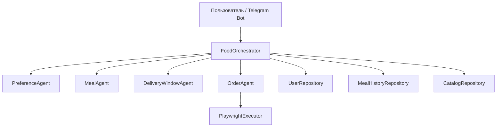

# Food AI Agent

Pet project на Python, реализующий multi-agent систему для автоматизации планирования питания и оформления заказа еды.

## Общее описание

Food AI Agent — это система из нескольких специализированных агентов, которая помогает пользователю автоматизировать ежедневные решения, связанные с едой.

Система умеет:

- хранить предпочтения и ограничения пользователя
- формировать план питания
- определять безопасное окно доставки
- формировать заказ
- работать через Telegram-бота
- сохранять состояние между запусками

Проект специально построен как **multi-agent архитектура**, а не как один “всемогущий” помощник.

---

## Цель проекта

Основная цель проекта — изучить, как несколько специализированных AI-агентов могут работать внутри одного прикладного пайплайна.

Вместо одного большого агента система разделяет ответственность между несколькими компонентами:

- один агент отвечает за предпочтения пользователя
- один агент отвечает за планирование питания
- один агент отвечает за решение по времени доставки
- один агент отвечает за формирование заказа

Такую архитектуру проще:

- объяснять
- тестировать
- масштабировать
- отлаживать

---

## Архитектура



---

## Агенты системы

### PreferenceAgent

Отвечает за разбор пользовательских предпочтений и обновление профиля пользователя.

Поддерживает извлечение:

- аллергий
- likes / dislikes
- запрещённых продуктов
- целевых калорий

### MealAgent

Формирует план питания с учётом:

- аллергий
- запрещённых продуктов
- likes / dislikes
- целевой калорийности
- недавней истории питания

На текущем этапе агент уже поддерживает:

- anti-repeat logic
- scoring trace
- объяснение причин выбора блюда

### DeliveryWindowAgent

Определяет, можно ли заказывать еду сейчас, или заказ нужно отложить на более безопасное окно доставки.

Агент умеет принимать решения:

- `order_now`
- `schedule_for_later`
- `do_not_order`

### OrderAgent

Преобразует `MealPlan` в `OrderPlan`, который затем может быть передан в execution layer.

Агент отвечает за:

- итоговый список позиций
- количество
- слот доставки
- параметры заказа

---

## Execution Layer

### PlaywrightExecutor

Сейчас реализован в виде **mock execution layer**.

На текущем этапе он симулирует выполнение заказа.

В следующих версиях может быть заменён на реальную браузерную автоматизацию через Playwright.

---

## Хранение данных

Проект использует JSON persistence.

Сохраняются:

- профили пользователей
- история meal plan

Локальные данные пользователя специально не отправляются в GitHub.

---

## Telegram-бот

Проект содержит Telegram-интерфейс для взаимодействия с системой.

### Поддерживаемые команды

- `/start`
- `/help`
- `/prefs <текст>`
- `/profile`
- `/plan`

### Пример команды

```text
/prefs У меня аллергия на milk, eggs. Не люблю fish и broccoli. Люблю chicken, rice. Мне нужно 2200 ккал.
```

---

## Структура проекта

```text
app/
├── agents/
│   ├── preference_agent.py
│   ├── meal_agent.py
│   ├── delivery_window_agent.py
│   └── order_agent.py
├── core/
│   └── config.py
├── models/
│   ├── user_profile.py
│   ├── meal.py
│   ├── delivery.py
│   └── order.py
├── orchestrator/
│   └── food_orchestrator.py
├── repositories/
│   ├── user_repository.py
│   ├── meal_history_repository.py
│   └── catalog_repository.py
├── services/
│   ├── llm_service.py
│   ├── telegram_service.py
│   └── playwright_executor.py
├── bootstrap.py
├── bot.py
└── main.py
```

---

## Стек технологий

- Python
- aiogram
- OpenAI API
- Playwright
- JSON storage

---

## Локальный запуск

### 1. Создание виртуального окружения

```bash
python -m venv .venv
```

### 2. Активация окружения

Windows PowerShell:

```bash
.\.venv\Scripts\Activate.ps1
```

### 3. Установка зависимостей

```bash
pip install -r requirements.txt
python -m playwright install
```

### 4. Настройка переменных окружения

Создать `.env`:

```env
OPENAI_API_KEY=your_api_key
OPENAI_MODEL=gpt-5-mini
TELEGRAM_BOT_TOKEN=your_bot_token
```

### 5. Запуск Telegram-бота

```bash
python -m app.bot
```

### 6. Запуск локальной точки входа

```bash
python -m app.main
```

---

## Текущий статус проекта

### Реализовано

- базовая структура проекта
- модели данных
- multi-agent orchestration
- Telegram-бот
- JSON persistence
- rule-based обработка предпочтений
- генерация meal plan
- логика безопасного окна доставки
- формирование заказа
- anti-repeat logic
- scoring trace в MealAgent

### В планах

- LLM-based preference extraction
- реальная интеграция с Playwright
- учёт бюджета
- weekly planning
- улучшение explainability
- поддержка реальных delivery providers

---

## Почему именно multi-agent подход

Проект специально построен не как один большой ассистент, а как набор специализированных агентов.

Преимущества такого подхода:

- чёткое разделение ответственности
- более понятная архитектура
- проще тестировать каждый компонент отдельно
- легче отлаживать
- выше explainability
- удобнее масштабировать дальше

---

## Roadmap

### Этап 1 — Базовый MVP

- структура проекта
- модели данных
- Telegram-бот
- JSON persistence
- rule-based агенты
- mock execution layer

### Этап 2 — Улучшение логики принятия решений

- anti-repeat logic
- scoring trace
- более качественный подбор блюд
- weekly planning
- budget-aware planning

### Этап 3 — Интеграции

- реальный Playwright flow
- заполнение корзины на сайте доставки
- полуавтоматическое или автоматическое оформление заказа
- логирование результатов исполнения

### Этап 4 — LLM-улучшения

- LLM-based extraction preferences
- более гибкий meal planning
- объяснение выбора блюд
- адаптация на основе пользовательской истории

---

## Важные замечания

- `.env` не хранится в репозитории
- локальные пользовательские данные не хранятся в GitHub
- execution layer пока реализован как mock
- основной фокус проекта сейчас — архитектура и взаимодействие агентов

---

## Автор

Проект создан как личный pet project для изучения multi-agent систем.